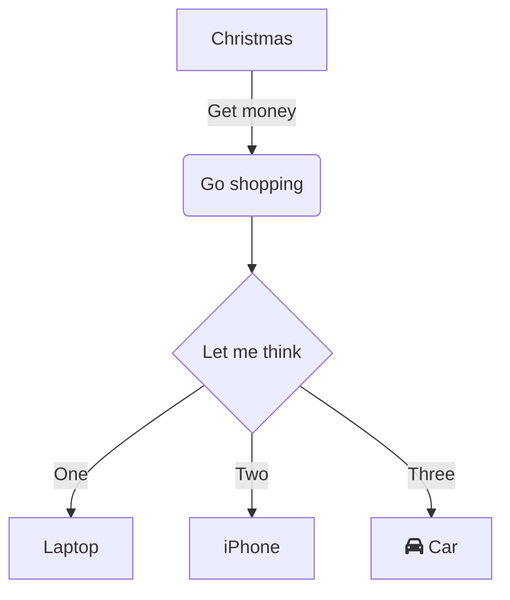

[go编程实战](https://github.com/goinaction/code)笔记
# 笔记
## 基本建议
* 使用组合作为代码复用的基本模块
* 推荐使用sync.WaitGroup跟踪goroutine的工作是否完成 WaitGroup add done wait
* interface{}
* 命名导入， 
* init,可以在main函数执行前进行初始化，例子，postgre将自己注册到sql包中，使用 _ 空白标识符导入，促使包中的init执行

## 工具
* godoc strings
* go get -u packageurl
* go clean
* 3 个点表示匹配所有的字符串。例如，下面的命令会编译 chapter3 目录下的所有包 go build pacakage/...
* go build 
* go build -race 用竞争检测器来编译，执行后会检测竞争条件
* go run 
* go vet
* go fmt
* go doc tar
* godoc -http=:8080
* go get

# 资源
* [go playground](https://play.golang.org/)
* cd $GOPATH/src/github.com/exfly && rsync -av  lngo /Users/haifei.zhang/Project/exfly/ComputSciLab/Code/Go/
